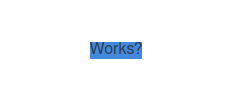

# vue-build-cssvars

## Summary

this is a bare project showing css variables in vue.

- all relavant code in `App.vue`
- build minimization turned off in `vue.config.js`
- running `yarn serve` shows the following page

## Issue

When building for production, css vars do not get injected to the component

